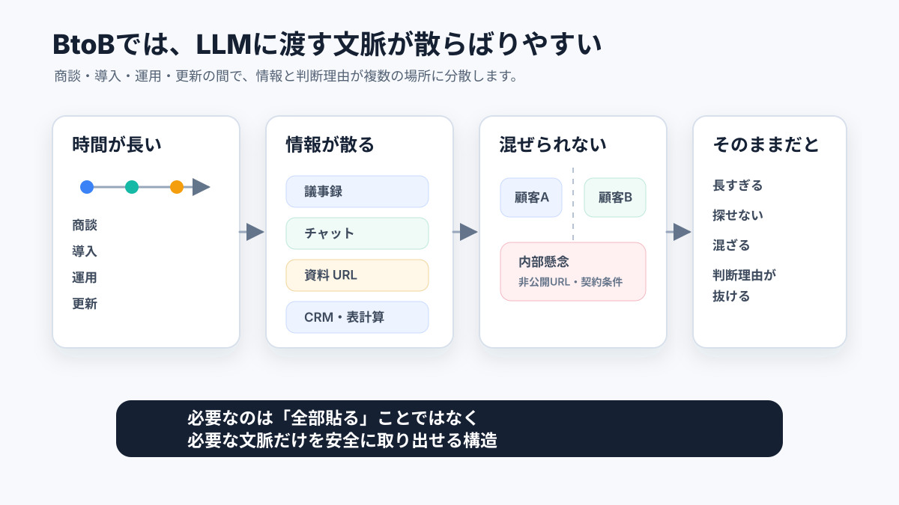
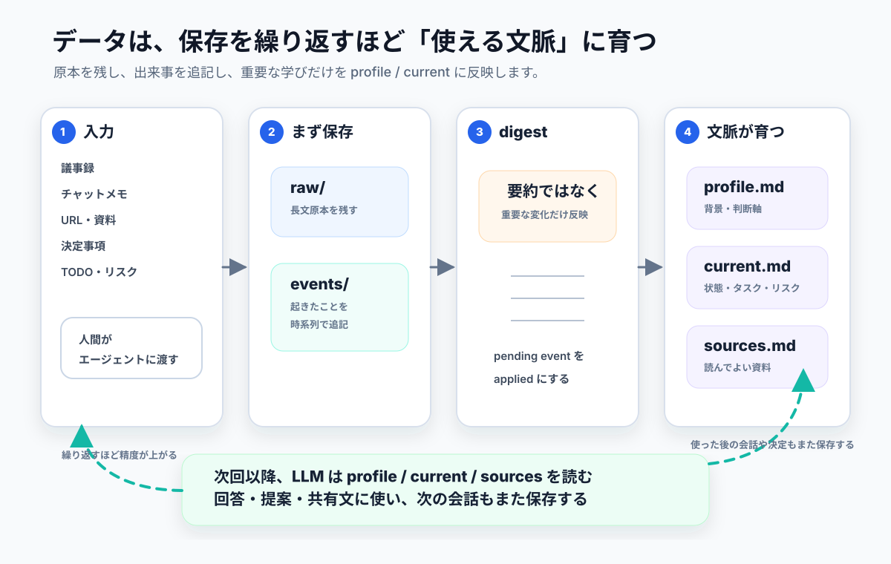

# BtoB Project Memory Template

BtoB の顧客対応、商談メモ、導入・納品プロジェクト、更新商談、社内プロジェクトを entity 別に管理するための memory vault テンプレートです。

この repository は、Obsidian vault として開き、Codex や Claude Code などのエージェントが repository 内の skill に従って更新する前提で作っています。含まれるデータはすべて架空のサンプルで、URL も `example.com` だけを使っています。公開 repository に、実在顧客の情報、秘密情報、個人情報、契約金額、非公開 URL は追加しないでください。

Issue は受け付けます。Pull Request は原則として受け付けていないため、改善提案はまず Issue で相談してください。自社データを扱う場合は fork ではなく、GitHub の template 機能で private repository として作成してください。



BtoB 取引では、時間、ツール、顧客境界、社内判断が分散します。このテンプレートは、それらを LLM が安全に読める文脈へ整理するためのものです。

## なぜ必要か

LLM に良い仕事をさせるには、モデルそのものの性能だけでなく、渡すコンテキストの質が重要です。商談の背景、過去の約束、相手の関心、社内の判断理由、未解決のリスク、次に取るべきアクションが抜けていると、LLM はもっともらしい一般論を返しやすくなります。

一方で、BtoB 取引や社内プロジェクトのコンテキストを LLM に渡すのは簡単ではありません。

- 商談、導入、運用、更新、請求、社内調整が数週間から数か月にまたがる。
- 顧客ごと、部門ごと、担当者ごとに前提や関心が違う。
- 議事録、チャット、Google Workspace、CRM、手元メモに情報が散らばる。
- 「なぜそう判断したか」が結果だけの記録から抜け落ちやすい。
- ほかの顧客情報、内部懸念、非公開 URL、契約条件を混ぜてはいけない。
- すべてを毎回 prompt に貼るには長すぎ、必要な情報だけを人間が選ぶのも重い。

このテンプレートは、LLM に「全部覚えさせる」ものではありません。顧客・社内プロジェクトごとに、読むべき文脈、追記する事実、現在の状態、参照してよい外部資料を分けて置き、エージェントが毎回同じ手順で必要な範囲を読むための保管庫です。

## どう機能するか



この repository では、情報を用途ごとに分けます。

- `events/`: いつ何が起きたかを残す追記専用の時系列記録。
- `raw/`: 議事録や長文メモの原本。複数 entity をまたぐ内容も、原本はここに 1 つだけ置く。
- `profile.md`: 長く使う背景、判断軸、制約、関係性を集約する安定コンテキスト。
- `states/current.md`: 現在の状態、未完了タスク、リスク、次アクションを集約する作業面。
- `sources.md`: LLM が継続的に参照してよい外部資料と、必要なときだけ読む資料を分ける索引。
- `.agentic/skills/`: 保存、digest、query、output の読み書き手順を固定するルール。

人間は議事録やメモをエージェントに渡します。エージェントはまず `scripts/memory save ...` で保存用 prompt を作り、`memory-save` skill に従って raw note と薄い event を作ります。その後、必要に応じて `memory-digest` が event から `profile.md` と `states/current.md` を更新します。

質問や下書き作成では、エージェントは対象 entity の `profile.md` と `states/current.md` を先に読みます。監査性が必要な場合は event を確認し、外部資料が必要な場合だけ `sources.md` の `context: yes` または `on_demand` の URL を見ます。取得できない資料の中身は推測しません。

この構造により、LLM に毎回巨大な履歴を貼らなくても、必要な背景を短く安定した形で渡せます。同時に、顧客ごとの情報を混ぜない、event を後から書き換えない、顧客向け draft に内部情報を混ぜない、といった BtoB で重要な安全性も repository のルールと lint で確認できます。

## これは何か

- `clients/`: 顧客別の `profile.md`、`sources.md`、`states/current.md`、追記専用 event。
- `internal/`: 社内プロジェクト別の `profile.md`、`sources.md`、`states/current.md`、追記専用 event。
- `raw/`: 議事録や長文メモの原本置き場。社内用 memory として扱い、顧客向け draft に直接コピーしません。
- `company/`: マネジメントが管理する戦略、ルール、セッション指針。
- `.agentic/skills/`: 保存、digest、query、output、lint、新規追加の正本 skill。
- `scripts/memory`: status、lint、smoke test、prompt 生成、publish、sync の補助 CLI。

Obsidian からは、`clients/*/profile.md`、`clients/*/sources.md`、`clients/*/states/current.md`、`internal/*/profile.md`、`internal/*/sources.md`、`internal/*/states/current.md`、`raw/*.md` を手動編集できます。`events/` は追記専用なので、作成や訂正は skill 経由で行います。

## クイックスタート

```bash
git clone https://github.com/tsutomutomizawa/btob-project-memory-template.git
cd btob-project-memory-template
./scripts/setup-member.sh
scripts/memory status --with-lint
```

Python 3.10 以上が必要です。Windows では Git Bash から実行してください。

## 日常の流れ

1. 議事録、メモ、URL、決定事項、修正依頼をエージェントに渡す。
2. エージェントがまず `scripts/memory save ...` を実行し、skill 用 prompt を生成する。
3. `memory-save` が raw note と薄い追記専用 event を作る。
4. `memory-digest` が pending event から `profile.md` と `states/current.md` を更新する。
5. `memory-query` が対象 entity の文脈から読み取り専用で回答する。
6. `memory-output` が顧客向け共有文や提案文をチャット上で draft として作る。output file は repository に保存しない。
7. `scripts/memory lint` と `scripts/memory smoke` で vault の健全性を確認する。

## 含まれるサンプル

- `clients/sample-saas-platform`: BtoB SaaS の更新商談と部門展開のサンプル。
- `clients/sample-industrial-supplier`: 産業資材取引の見積・納期調整のサンプル。
- `internal/sales-process-improvement`: 商談メモと見積承認フロー改善のサンプル。

すべて架空のサンプルなので、自社用途に合わせて安全に置き換えてください。

## ライセンス

MIT。詳細は [LICENSE](LICENSE) を確認してください。
